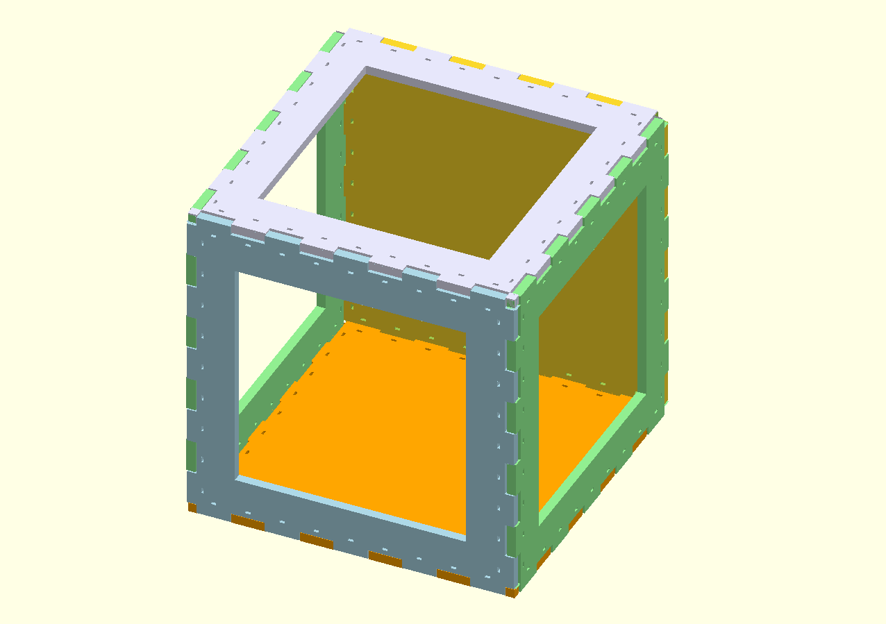

# reprap-ziptie-box

An experiment inspired by the use of zip ties in nicholas seward's corexz.

Designed to be laser cut and assembled using zip ties rather than using washers/nuts/bolts.

## Definite upsides

  * simpler code to generate the box

## Possible upsides

  * easier assembly
  * stronger assembly (zip tie is less likely to pull through material than m3 nuts)
  * cheaper assembly (&lt;$10USD for 200 4" zip ties)
  * easier to source parts
  * more colorful
  * faster rendering
