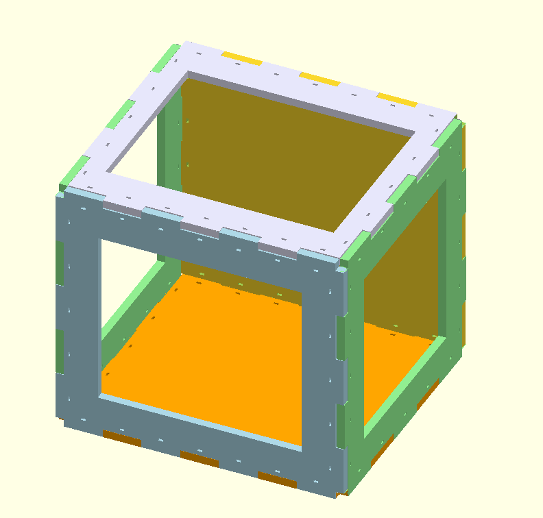

# reprap-ziptie-box

An experiment inspired by the use of zip ties in nicholas seward's corexz.

## Definite upsides

  * simpler code to generate the box
  * faster rendering of sheets

## Possible upsides

  * easier assembly
  * stronger assembly
  * cheaper assembly
  * easier to source parts
